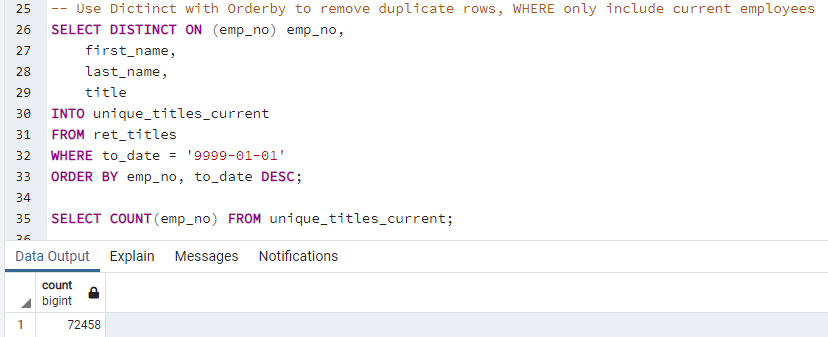
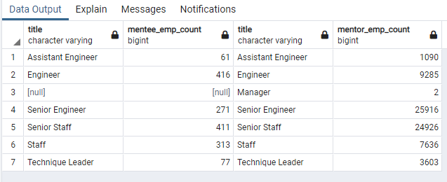

# Pewlett-Hackard-Analysis
Using SQL, perform analysis on employees and determine future position openings

## Overview
In order to prepare for future hiring demands, it was necessary to perform employee research within Pewlett-Hackard to find eligible employees who may soon retire and how many positions may need to be filled in the future.  Eligibility for retirement may vary by personal preference, state and federal benefit eligibility, and changing company standards.  For this study, retirement age was defined as employees between 66 and 69 years old so employees eligible for retirement were identified based on birthdays between January 1, 1952 and December 31, 1955.  The table generated is provided as “retirement_titles.csv” in the Data folder.

A mentorship program is planned to encourage employees nearing retirement to mentor current employees who are likely not retiring.  Eligibility for the mentorship program was based on current employees born between January 1, 1965 and December 31, 1965.  A list of eligible participants is provided as “mentorship_eligibility.csv” in the Data folder.

## Results

Based on the queries generated here, there were four (4) main findings:

1. Pewlet Hackard has 133,776 employees born between January 1, 1952 and December 31, 1955 who are eligible for retirement.

2. The list of current employees eligible for retirement was extensive and it was discovered that the list included duplicates (employees who were promoted/served multiple roles within the company) thus a second table was generated as “unique_titles.csv” where duplicates were removed, keeping only unique employee counts by employee numbers.  Considering only unique employee numbers, the number of eligible employees was reduced to 90,398 employees who are eligible for retirement.

   * After investigating the “unique_titles” table further it was determined that some of the employees listed do not have a current “to_date” meaning they are likely not current employees. When filtering the data to only include only the most current “to_date,” the number of eligible employees was further reduced to 72,458 employees who are eligible for retirement.  The resulting table was generated as “unique_titiles_current.csv.”

3. To examine the potential open positions more specifically, the number of retiring employees was identified per position title.  Based on the count of unique employees retiring, the top two positions are “Senior Engineer” titles and “Senior Staff” titles which together represent about 64% of the retiring workforce that is, 57,668 of the possible 90,398 unique retirees.  The table generated from this query is named “retiring_titles.csv” found in the Data folder.

   * If using the “unique_titles_current” data, the top two positions are still “Senior Engineer” titles and “Senior Staff” titles however the numbers change to 50,842 out of 72,458 which increases the count for senior level positions retiring to roughly 70% of the total.
   * Note that in both “unique_titles” and “unique_titles_current,” only 2 of the 9 department managers are eligible for retirement based on this study’s criteria.  

4. There are 1,549 employees eligible for the mentorship program of which 857 or just over half (56%) are not in senior level (Senior Engineer, Senior Staff) positions.

### Summary

If all eligible employees retire, about 72,458 roles will need to be filled based on query criteria of *current* employees born between January 1, 1952 and December 31, 1955, with unique employee numbers.

In order to determine if there are enough qualified, retirement-ready employees in each of the departments to mentor the next generation of Pewlett Hackard employees, new queries were created to count the number of employees in each eligible pool.  The counts were saved as ‘mentor_count.csv’ and ‘mentee_count.csv.’  Merging the tables shows the counts side-by-side to demonstrate there will be more than enough retiring mentors available in each category for the mentorship program.

